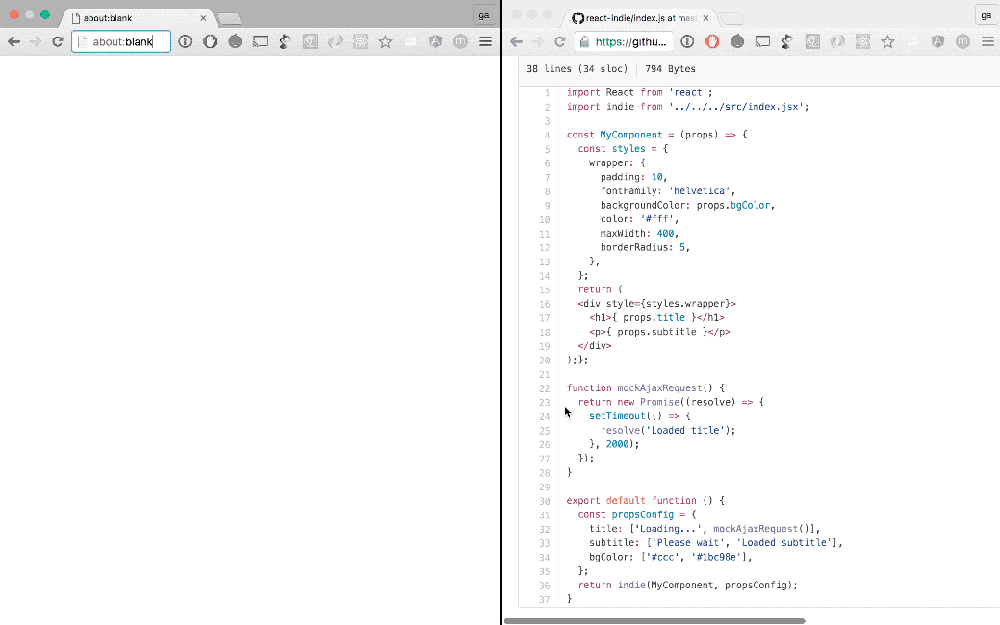

# react-indie

[](https://www.npmjs.com/package/react-indie)
[](https://travis-ci.org/gavriguy/react-indie)

An independent react Component that holds all its logic inside.

> Works with any react Architecture out there - at the end react-indie outputs a
simple React component.



> The gif is showing the built in project example. See [Live Playground] bellow for running it on your local machine, or check out [the example code](https://github.com/gavriguy/react-indie/tree/master/example) on github.

There are cases that you want to have in your react code an independent component
that is not connected to the rest of the application global store (e.g. redux).

I'm not talking about pure stateless components but on stateful components that
don't need to share their knowledge with the rest of the app; an example to
that kind of component can be a wether widget that gets the current temperature
from a remote server and doesn't affect the rest of your app. Another example
can be a dashboard widget that gets its data from a specific service.

## Architecture

The idea is to wrap a given React component with the `indie` API and pass to it
its initial state and a load state with a set of promises that get resolved when
all its promises are resolved:

```jsx

import indie from 'indie';

// suppose you have a weather component:
<Weather temperature={value}>

// you can now set a its initial value + inject remote temperature data
// in a self contained manner (without any relation to the hosting react app)

indie()
  .initial(() => ({
    temperature: "loading..."
  })
  .load(() => ({
    temperature: getWeather() // an async function that returns a promise.
  }))
  .render(Weather) // pass component without its props

  // NOTE: the above example uses parenthesized body shortcut (es2015 feature)
  // in the `initial` & `load` functions to return the object literal expression
  // without using the `return` expression.

```

## Install

`npm install react-indie --save`


## Live Playground

* clone this repo on your machine
* `npm install`
* `npm run example`
* visit `http://localhost:8080/`

> You can also run test by calling `npm test`


## TODOs

* Handle Promises Rejections
* Add built-in data refresh mechanism (good for widgets)


## Acknowledgements

The idea of self contained Component was inspired from react-storybook -
https://github.com/kadirahq/react-storybook . I also took the idea of using
a js chain of actions for the API.

The package code setup inspired from https://github.com/airbnb/rheostat
Architecture inspired form storybook
